# Enhanced WhatsApp Recruitment Platform - Architecture Diagram

## Current vs. Proposed Architecture

### Current Architecture (Problems)
```
User ──> WhatsApp ──> Meta API ──> Webhook ──> Dispatcher Server ──> AI Agent
                                       │
                                       ▼
                                   Database
```

**Issues:**
- Linear, synchronous processing
- No event tracking or analytics
- No intervention capabilities
- Black box operations

### Proposed Enhanced Architecture

```mermaid
graph TB
    %% User Layer
    U[👤 Candidate] --> WA[📱 WhatsApp]
    R[👩‍💼 Recruiter] --> OI[💻 Operator Interface]
    R --> AD[📊 Analytics Dashboard]
    
    %% External APIs
    WA --> META[🔗 Meta WhatsApp API]
    
    %% API Gateway
    META --> AG[🛡️ API Gateway<br/>Kong/AWS ALB]
    OI --> AG
    AD --> AG
    
    %% Event Bus - Central Nervous System
    AG --> EB[🚌 Event Bus<br/>Apache Kafka]
    
    %% Microservices Layer
    EB --> WHS[📡 Webhook Service]
    EB --> CMS[💬 Conversation Mgmt]
    EB --> SMS[📝 State Management]
    EB --> RSS[⚠️ Risk Scoring]
    EB --> NS[🔔 Notification Service]
    EB --> AS[📈 Analytics Service]
    EB --> OS[👥 Operator Service]
    EB --> MLS[🤖 ML/AI Service]
    EB --> DAS[📊 Data Aggregation]
    
    %% External Integrations
    NS --> SLACK[💬 Slack API]
    NS --> EMAIL[📧 Email Service]
    
    %% Data Layer
    WHS --> PG[(🗃️ PostgreSQL<br/>Candidate Data)]
    CMS --> REDIS[(⚡ Redis<br/>Sessions & Cache)]
    SMS --> PG
    RSS --> PG
    AS --> INFLUX[(📊 InfluxDB<br/>Time-series)]
    OS --> REDIS
    MLS --> PG
    DAS --> INFLUX
    
    %% Storage
    CMS --> S3[(☁️ S3/Blob Storage<br/>Conversation Logs)]
    
    %% Monitoring & Observability
    ALL[All Services] --> MON[📊 Monitoring<br/>Prometheus/Grafana]
    ALL --> LOG[📝 Centralized Logging<br/>ELK Stack]
    ALL --> TRACE[🔍 Distributed Tracing<br/>Jaeger]
    
    %% Styling
    classDef userLayer fill:#e1f5fe
    classDef externalAPI fill:#fff3e0
    classDef infrastructure fill:#f3e5f5
    classDef microservice fill:#e8f5e8
    classDef datastore fill:#fff8e1
    classDef monitoring fill:#fce4ec
    
    class U,R userLayer
    class WA,META,SLACK,EMAIL externalAPI
    class AG,EB infrastructure
    class WHS,CMS,SMS,RSS,NS,AS,OS,MLS,DAS microservice
    class PG,REDIS,INFLUX,S3 datastore
    class MON,LOG,TRACE monitoring
```



## Service Interaction Flow

### 1. Normal Conversation Flow


### 2. Risk Detection & Intervention Flow


### 3. Operator Takeover Flow


## Event Schema Design

### Core Events
```yaml
# Message Events
MessageReceived:
  candidateId: string
  messageId: string
  content: string
  timestamp: datetime
  source: "whatsapp"

MessageSent:
  candidateId: string
  messageId: string
  content: string
  timestamp: datetime
  source: "bot" | "operator"
  operatorId?: string

# State Events
CandidateStateChanged:
  candidateId: string
  previousState: string
  newState: string
  timestamp: datetime
  trigger: string

# Risk Events
CandidateAtRisk:
  candidateId: string
  riskScore: number
  riskFactors: string[]
  lastActivity: datetime
  recommendedAction: string

# Operator Events
OperatorTakeover:
  candidateId: string
  operatorId: string
  timestamp: datetime
  reason: string

OperatorHandback:
  candidateId: string
  operatorId: string
  timestamp: datetime
  summary: string
```

## Data Model Design

### PostgreSQL Schema
```sql
-- Candidates table
CREATE TABLE candidates (
    id UUID PRIMARY KEY,
    phone_number VARCHAR(20) UNIQUE NOT NULL,
    first_name VARCHAR(100),
    last_name VARCHAR(100),
    email VARCHAR(255),
    current_state VARCHAR(50) NOT NULL,
    risk_score DECIMAL(3,2) DEFAULT 0.0,
    created_at TIMESTAMP DEFAULT NOW(),
    updated_at TIMESTAMP DEFAULT NOW(),
    last_activity_at TIMESTAMP DEFAULT NOW()
);

-- Conversation sessions
CREATE TABLE conversation_sessions (
    id UUID PRIMARY KEY,
    candidate_id UUID REFERENCES candidates(id),
    session_type VARCHAR(20) DEFAULT 'automated', -- 'automated' | 'operator'
    operator_id UUID,
    started_at TIMESTAMP DEFAULT NOW(),
    ended_at TIMESTAMP,
    status VARCHAR(20) DEFAULT 'active' -- 'active' | 'completed' | 'abandoned'
);

-- Messages
CREATE TABLE messages (
    id UUID PRIMARY KEY,
    session_id UUID REFERENCES conversation_sessions(id),
    candidate_id UUID REFERENCES candidates(id),
    content TEXT NOT NULL,
    direction VARCHAR(10) NOT NULL, -- 'inbound' | 'outbound'
    source VARCHAR(20) NOT NULL, -- 'candidate' | 'bot' | 'operator'
    operator_id UUID,
    created_at TIMESTAMP DEFAULT NOW()
);

-- Recruitment states/stages
CREATE TABLE recruitment_stages (
    id UUID PRIMARY KEY,
    name VARCHAR(100) NOT NULL,
    description TEXT,
    order_index INTEGER NOT NULL,
    is_active BOOLEAN DEFAULT true
);

-- Candidate journey tracking
CREATE TABLE candidate_journey (
    id UUID PRIMARY KEY,
    candidate_id UUID REFERENCES candidates(id),
    stage_id UUID REFERENCES recruitment_stages(id),
    entered_at TIMESTAMP DEFAULT NOW(),
    completed_at TIMESTAMP,
    status VARCHAR(20) DEFAULT 'in_progress' -- 'in_progress' | 'completed' | 'skipped'
);

-- Risk factors
CREATE TABLE risk_assessments (
    id UUID PRIMARY KEY,
    candidate_id UUID REFERENCES candidates(id),
    risk_score DECIMAL(3,2) NOT NULL,
    risk_factors JSONB,
    assessed_at TIMESTAMP DEFAULT NOW(),
    assessment_reason VARCHAR(500)
);

-- Operator interventions
CREATE TABLE operator_interventions (
    id UUID PRIMARY KEY,
    candidate_id UUID REFERENCES candidates(id),
    operator_id UUID NOT NULL,
    intervention_type VARCHAR(50), -- 'takeover' | 'proactive_message'
    started_at TIMESTAMP DEFAULT NOW(),
    ended_at TIMESTAMP,
    outcome VARCHAR(100),
    notes TEXT
);
```

### Redis Data Structures
```redis
# Session state management
candidate_session:{candidateId} -> {
  "sessionId": "uuid",
  "currentState": "technical_challenge",
  "isOperatorActive": false,
  "operatorId": null,
  "lastActivity": "2025-08-24T10:30:00Z",
  "contextData": {...}
}

# Real-time analytics cache
funnel_stats:realtime -> {
  "total_active": 150,
  "stage_counts": {
    "initial_contact": 45,
    "technical_challenge": 67,
    "cultural_fit": 23,
    "final_review": 15
  },
  "last_updated": "2025-08-24T10:30:00Z"
}

# Operator presence
operator_status:{operatorId} -> {
  "isOnline": true,
  "activeCandidates": ["candidate1", "candidate2"],
  "lastSeen": "2025-08-24T10:30:00Z"
}
```

## Monitoring & Alerting Strategy

### Business Metrics Dashboard
```yaml
Funnel Metrics:
  - Candidates by stage (real-time)
  - Stage conversion rates
  - Average time in each stage
  - Drop-off points analysis

Risk Management:
  - At-risk candidates count
  - Risk score distribution
  - Intervention success rates
  - Operator response times

Performance Metrics:
  - Message processing latency
  - Event processing throughput
  - System availability
  - API response times
```

### Alert Definitions
```yaml
Critical Alerts:
  - Service down > 1 minute
  - Message processing delay > 30 seconds
  - Database connection failures
  - High error rates (>1%)

Business Alerts:
  - High-value candidate at risk
  - Unusual drop-off spike
  - Operator queue backup
  - Low conversion rate trends

Warning Alerts:
  - High latency (>1 second)
  - Memory usage >80%
  - Disk space <20%
  - Queue length growing
```

## Security & Compliance Framework

### Data Protection
```yaml
Encryption:
  - Data at rest: AES-256
  - Data in transit: TLS 1.3
  - Database: Transparent Data Encryption
  - Message content: End-to-end encryption

Access Controls:
  - Multi-factor authentication
  - Role-based access control (RBAC)
  - API key rotation
  - Session management

Privacy Compliance:
  - GDPR Article 17 (Right to erasure)
  - Data minimization principles
  - Consent management
  - Data retention policies
```

## Deployment Architecture

### Kubernetes Deployment
```yaml
# Namespace organization
namespaces:
  - recruitment-platform-prod
  - recruitment-platform-staging
  - recruitment-platform-dev

# Service mesh (Istio)
service_mesh:
  - mTLS between services
  - Traffic routing and load balancing
  - Observability and tracing
  - Circuit breaker patterns

# Auto-scaling
horizontal_pod_autoscaling:
  - CPU-based scaling
  - Memory-based scaling
  - Custom metrics (queue length)
  - Predictive scaling

# Storage
persistent_volumes:
  - PostgreSQL: SSD storage classes
  - Redis: Memory-optimized instances
  - InfluxDB: Time-series optimized storage
```

This enhanced architecture provides:

1. **Complete Visibility**: Every interaction is tracked and analyzed in real-time
2. **Proactive Intervention**: ML-powered risk scoring identifies at-risk candidates automatically
3. **Seamless Human Takeover**: Operators can intervene without losing context
4. **Scalable Foundation**: Microservices architecture supports growth
5. **Operational Excellence**: Comprehensive monitoring and alerting

The event-driven design ensures all components stay synchronized while maintaining loose coupling, and the multi-database approach optimizes for different data access patterns.
