# Enhanced WhatsApp Recruitment Platform - Architecture Diagram

## Current vs. Proposed Architecture

### Current Architecture (Problems)
```
User ──> WhatsApp ──> Meta API ──> Webhook ──> Dispatcher Server ──> AI Agent
                                       │
                                       ▼
                                   Database
```

**Issues:**
- Linear, synchronous processing
- No event tracking or analytics
- No intervention capabilities
- Black box operations

### Proposed Enhanced Architecture

```mermaid
graph TB
    %% User Layer
    U[👤 Candidate] --> WA[📱 WhatsApp]
    R[👩‍💼 Recruiter] --> OI[💻 Operator Interface]
    R --> AD[📊 Analytics Dashboard]
    
    %% External APIs
    WA --> META[🔗 Meta WhatsApp API]
    
    %% API Gateway
    META --> AG[🛡️ API Gateway<br/>Kong/AWS ALB]
    OI --> AG
    AD --> AG
    
    %% Event Bus - Central Nervous System
    AG --> EB[🚌 Event Bus<br/>Apache Kafka]
    
    %% Microservices Layer
    EB --> WHS[📡 Webhook Service]
    EB --> CMS[💬 Conversation Mgmt]
    EB --> SMS[📝 State Management]
    EB --> RSS[⚠️ Risk Scoring]
    EB --> NS[🔔 Notification Service]
    EB --> AS[📈 Analytics Service]
    EB --> OS[👥 Operator Service]
    EB --> MLS[🤖 ML/AI Service]
    EB --> DAS[📊 Data Aggregation]
    
    %% External Integrations
    NS --> SLACK[💬 Slack API]
    NS --> EMAIL[📧 Email Service]
    
    %% Data Layer
    WHS --> PG[(🗃️ PostgreSQL<br/>Candidate Data)]
    CMS --> REDIS[(⚡ Redis<br/>Sessions & Cache)]
    SMS --> PG
    RSS --> PG
    AS --> INFLUX[(📊 InfluxDB<br/>Time-series)]
    OS --> REDIS
    MLS --> PG
    DAS --> INFLUX
    
    %% Storage
    CMS --> S3[(☁️ S3/Blob Storage<br/>Conversation Logs)]
    
    %% Monitoring & Observability
    ALL[All Services] --> MON[📊 Monitoring<br/>Prometheus/Grafana]
    ALL --> LOG[📝 Centralized Logging<br/>ELK Stack]
    ALL --> TRACE[🔍 Distributed Tracing<br/>Jaeger]
    
    %% Styling
    classDef userLayer fill:#e1f5fe
    classDef externalAPI fill:#fff3e0
    classDef infrastructure fill:#f3e5f5
    classDef microservice fill:#e8f5e8
    classDef datastore fill:#fff8e1
    classDef monitoring fill:#fce4ec
    
    class U,R userLayer
    class WA,META,SLACK,EMAIL externalAPI
    class AG,EB infrastructure
    class WHS,CMS,SMS,RSS,NS,AS,OS,MLS,DAS microservice
    class PG,REDIS,INFLUX,S3 datastore
    class MON,LOG,TRACE monitoring
```



## Service Interaction Flow

### 1. Normal Conversation Flow


### 2. Risk Detection & Intervention Flow


### 3. Operator Takeover Flow


## Monitoring & Alerting Strategy

### Business Metrics Dashboard
```yaml
Funnel Metrics:
  - Candidates by stage (real-time)
  - Stage conversion rates
  - Average time in each stage
  - Drop-off points analysis

Risk Management:
  - At-risk candidates count
  - Risk score distribution
  - Intervention success rates
  - Operator response times

Performance Metrics:
  - Message processing latency
  - Event processing throughput
  - System availability
  - API response times
```

### Alert Definitions
```yaml
Critical Alerts:
  - Service down > 1 minute
  - Message processing delay > 30 seconds
  - Database connection failures
  - High error rates (>1%)

Business Alerts:
  - High-value candidate at risk
  - Unusual drop-off spike
  - Operator queue backup
  - Low conversion rate trends

Warning Alerts:
  - High latency (>1 second)
  - Memory usage >80%
  - Disk space <20%
  - Queue length growing
```

## Security & Compliance Framework

### Data Protection
```yaml
Encryption:
  - Data at rest: AES-256
  - Data in transit: TLS 1.3
  - Database: Transparent Data Encryption
  - Message content: End-to-end encryption

Access Controls:
  - Multi-factor authentication
  - Role-based access control (RBAC)
  - API key rotation
  - Session management

Privacy Compliance:
  - GDPR Article 17 (Right to erasure)
  - Data minimization principles
  - Consent management
  - Data retention policies
```

## Deployment Architecture

### Kubernetes Deployment
```yaml
# Namespace organization
namespaces:
  - recruitment-platform-prod
  - recruitment-platform-staging
  - recruitment-platform-dev

# Service mesh (Istio)
service_mesh:
  - mTLS between services
  - Traffic routing and load balancing
  - Observability and tracing
  - Circuit breaker patterns

# Auto-scaling
horizontal_pod_autoscaling:
  - CPU-based scaling
  - Memory-based scaling
  - Custom metrics (queue length)
  - Predictive scaling

# Storage
persistent_volumes:
  - PostgreSQL: SSD storage classes
  - Redis: Memory-optimized instances
  - InfluxDB: Time-series optimized storage
```

This enhanced architecture provides:

1. **Complete Visibility**: Every interaction is tracked and analyzed in real-time
2. **Proactive Intervention**: ML-powered risk scoring identifies at-risk candidates automatically
3. **Seamless Human Takeover**: Operators can intervene without losing context
4. **Scalable Foundation**: Microservices architecture supports growth
5. **Operational Excellence**: Comprehensive monitoring and alerting

The event-driven design ensures all components stay synchronized while maintaining loose coupling, and the multi-database approach optimizes for different data access patterns.
