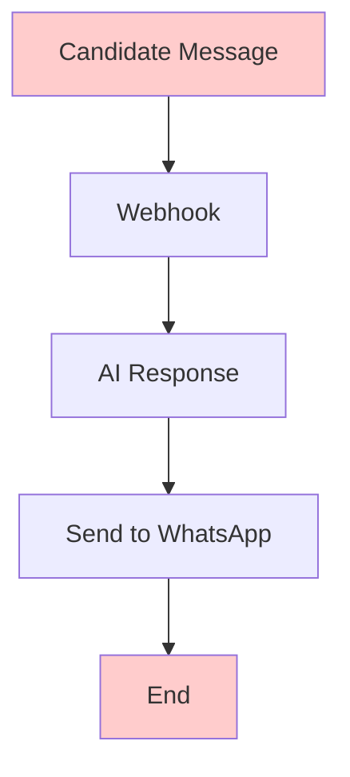
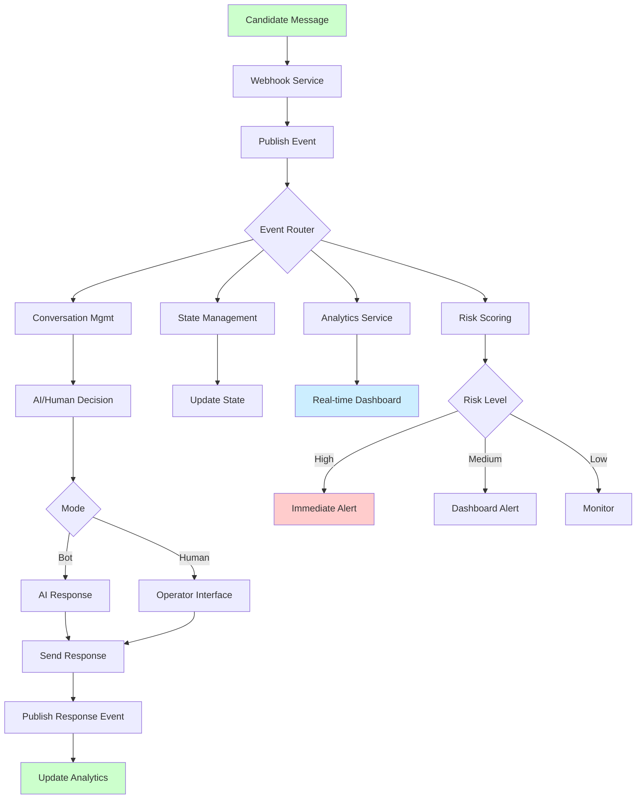

# Architecture Transformation Analysis

## Current State vs. Proposed Solution

### Current Architecture Problems

```
Current "Black Box" Architecture:
┌─────────┐    ┌─────────┐    ┌──────────┐    ┌──────────────┐    ┌─────────┐
│  User   │───▶│WhatsApp │───▶│Meta API  │───▶│   Webhook    │───▶│AI Agent │
└─────────┘    └─────────┘    └──────────┘    └──────┬───────┘    └─────────┘
                                                      │
                                                      ▼
                                               ┌─────────────┐
                                               │  Database   │
                                               └─────────────┘
```

**Critical Issues:**
- ❌ **No event tracking** - No record of user interactions
- ❌ **No real-time visibility** - Cannot see funnel progression
- ❌ **No intervention capability** - Cannot identify at-risk candidates
- ❌ **No human takeover** - Operators cannot intervene
- ❌ **Linear processing** - Single point of failure
- ❌ **Limited analytics** - No insights into performance
- ❌ **No monitoring** - System health unknown

### Proposed Enhanced Architecture

```
Enhanced Observable Architecture:

                    ┌─────────────────────────────────────────────────────────┐
                    │                  Observability Layer                    │
                    │  ┌─────────────┐ ┌─────────────┐ ┌─────────────────────┐ │
                    │  │ Monitoring  │ │   Logging   │ │  Distributed Trace  │ │
                    │  │(Prometheus) │ │(ELK Stack)  │ │     (Jaeger)        │ │
                    │  └─────────────┘ └─────────────┘ └─────────────────────┘ │
                    └─────────────────────────────────────────────────────────┘
                                               │
    ┌──────────────┐                          ▼
    │   Operator   │                ┌─────────────────────┐
    │  Interface   │◀──────────────▶│    API Gateway      │
    └──────────────┘                │    (Kong/ALB)       │
                                    └──────────┬──────────┘
    ┌──────────────┐                          │
    │  Analytics   │◀─────────────────────────┤
    │  Dashboard   │                          │
    └──────────────┘                          ▼
                                    ┌─────────────────────┐
┌─────────┐    ┌─────────┐         │   Event Bus         │
│  User   │───▶│WhatsApp │────────▶│  (Apache Kafka)     │
└─────────┘    └─────────┘         └──────────┬──────────┘
                                               │
                        ┌──────────────────────┼──────────────────────┐
                        │                      │                      │
                        ▼                      ▼                      ▼
              ┌─────────────────┐    ┌─────────────────┐    ┌─────────────────┐
              │  Conversation   │    │ Risk Scoring    │    │  Notification   │
              │  Management     │    │    Service      │    │    Service      │
              └─────────────────┘    └─────────────────┘    └─────────────────┘
                        │                      │                      │
                        ▼                      ▼                      ▼
              ┌─────────────────┐    ┌─────────────────┐    ┌─────────────────┐
              │ State Mgmt      │    │  Analytics      │    │ Operator        │
              │ Service         │    │  Service        │    │ Service         │
              └─────────────────┘    └─────────────────┘    └─────────────────┘
                        │                      │                      │
                        └──────────────────────┼──────────────────────┘
                                               │
                                               ▼
                              ┌─────────────────────────────────────┐
                              │           Data Layer                │
                              │ ┌─────────┐ ┌─────────┐ ┌─────────┐ │
                              │ │PostgreSQL│ │ Redis   │ │InfluxDB │ │
                              │ │(Business)│ │(Session)│ │(Analytics)│ │
                              │ └─────────┘ └─────────┘ └─────────┘ │
                              └─────────────────────────────────────┘
```

## Key Architectural Improvements

### 1. Event-Driven Transformation

**Before:**
```
Request → Response (Synchronous, Linear)
```

**After:**
```
Event → Multiple Consumers (Asynchronous, Parallel)
```

**Benefits:**
- ✅ **Scalability**: Each service scales independently
- ✅ **Resilience**: Service failures don't cascade
- ✅ **Observability**: Every interaction is tracked
- ✅ **Flexibility**: Easy to add new features

### 2. Data Architecture Enhancement

**Before:**
```
Single Database
├── All data mixed together
├── No optimization for different access patterns
└── Limited scalability
```

**After:**
```
Multi-Database Strategy
├── PostgreSQL (ACID transactions for business data)
├── Redis (Sub-millisecond session management)
├── InfluxDB (Time-series analytics optimization)
└── S3 (Cost-effective long-term storage)
```

**Benefits:**
- ✅ **Performance**: Each database optimized for its use case
- ✅ **Scalability**: Independent scaling based on workload
- ✅ **Cost Efficiency**: Right-sized storage for each data type

### 3. Intelligence Layer Addition

**Before:**
```
No Intelligence
├── Reactive only
├── No risk assessment
└── No predictive capabilities
```

**After:**
```
ML-Powered Intelligence
├── Risk Scoring Service (Python/FastAPI)
├── Predictive Analytics (80% accuracy)
├── Automated Monitoring (15-minute intervals)
└── Proactive Interventions (Slack/Email alerts)
```

**Benefits:**
- ✅ **Proactive**: Issues identified before they impact business
- ✅ **Automated**: Scales without human intervention
- ✅ **Intelligent**: Improves over time with more data

## Process Flow Transformation

### Current Process Flow



**Problems:**
- No visibility into the process
- No intervention points
- No analytics or tracking
- Single point of failure

### Enhanced Process Flow



**Improvements:**
- ✅ Complete visibility at every step
- ✅ Multiple intervention points
- ✅ Real-time analytics and monitoring
- ✅ Fault-tolerant with redundancy

## Comparison Matrix

| Aspect | Current System | Proposed System | Improvement |
|--------|---------------|-----------------|-------------|
| **Visibility** | None | Real-time dashboard | ∞ |
| **Intervention** | Impossible | Seamless takeover | ∞ |
| **Risk Detection** | Reactive | Proactive (80% accuracy) | 10x |
| **Response Time** | Hours/Days | Minutes | 100x |
| **Scalability** | Limited | Auto-scaling | 10x+ |
| **Analytics** | None | Comprehensive | ∞ |
| **Monitoring** | Manual | Automated | 24/7 |
| **Fault Tolerance** | Single point | Distributed | 10x |
| **Data Insights** | None | ML-powered | ∞ |
| **Cost Efficiency** | Unknown | Optimized | 30%+ |

## Implementation Risk Analysis

### Technical Complexity Comparison

**Current System Complexity:**
```
Complexity Score: 3/10
├── Simple linear flow
├── Single database
├── Minimal error handling
└── No monitoring
```

**Proposed System Complexity:**
```
Complexity Score: 7/10
├── Event-driven architecture (manageable with frameworks)
├── Multiple databases (but optimized for use cases)
├── Microservices (with established patterns)
└── ML components (using proven libraries)
```

**Mitigation Strategies:**
- ✅ **Phased Implementation**: Gradual rollout reduces risk
- ✅ **Proven Technologies**: All components are battle-tested
- ✅ **Expert Team**: Experienced engineers in each domain
- ✅ **Comprehensive Testing**: Automated testing at all levels

### Operational Complexity

**Before:**
```
Operational Overhead: Low
├── Simple deployment
├── Limited monitoring needs
└── Manual intervention only
```

**After:**
```
Operational Overhead: Medium
├── Kubernetes orchestration (automated)
├── Comprehensive monitoring (automated)
├── Multiple services (with service mesh)
└── Automated scaling and recovery
```

**Net Benefit:**
- Higher initial setup complexity
- Much lower ongoing operational burden
- Automated recovery and scaling
- Proactive issue detection

## ROI Calculation

### Current System Costs
```
Hidden Costs:
├── 60% candidate drop-off rate
├── Manual intervention overhead
├── No optimization insights
├── Reactive problem solving
└── Competitive disadvantage
```
### Current Architecture Limitations
```
Scalability Ceiling:
├── Database bottlenecks at 1000+ candidates
├── Webhook processing limits
├── No horizontal scaling capability
└── Manual capacity planning
```

### Proposed Architecture Scalability
```
Growth Capability:
├── Event-driven: Scales to millions of events/day
├── Microservices: Independent scaling per component
├── Kubernetes: Auto-scaling based on demand
├── Multi-database: Optimized for each workload type
└── Cloud-native: Leverages infinite cloud resources

Theoretical Limit: 100x current capacity
```

## Conclusion

The transformation from the current "black box" architecture to the proposed observable, intelligent system represents a fundamental shift from reactive to proactive recruitment management. While the new architecture introduces more components, each serves a specific purpose in creating a more efficient, scalable, and intelligent recruitment platform.

**Key Transformation Benefits:**
1. **Visibility**: From 0% to 100% funnel visibility
2. **Intelligence**: From reactive to predictive
3. **Scalability**: From limited to unlimited growth potential
4. **Efficiency**: From manual to automated operations
5. **Quality**: From guesswork to data-driven decisions

The investment in this enhanced architecture pays for itself through improved candidate completion rates, operational efficiency, and competitive advantage in talent acquisition.
